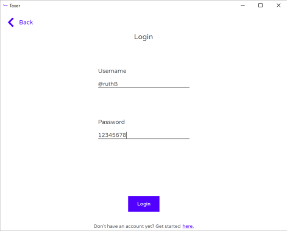
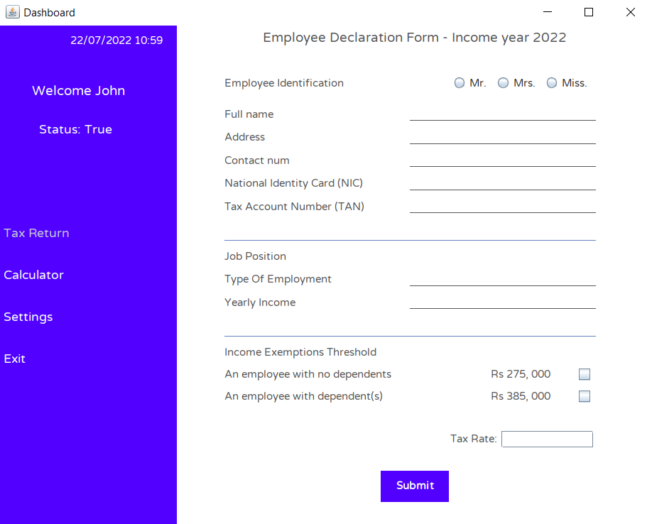
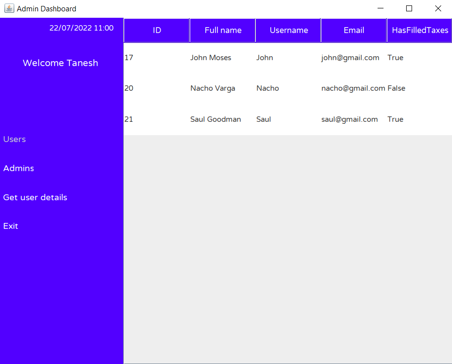

# Taxer
A java program to calculate tax returns. Made using Java Swing.

## Team:
 - [Zahra Oozeer](https://github.com/ZahraO)
 - [Tanesh Chuckowree](https://github.com/Tanesh1701)

## Features:
 - Login/Registration
 - Calculator
 - Separate dashboard for admins
 - Fill in tax returns and get the summary in a textfile

 ## Screenshots:

 
